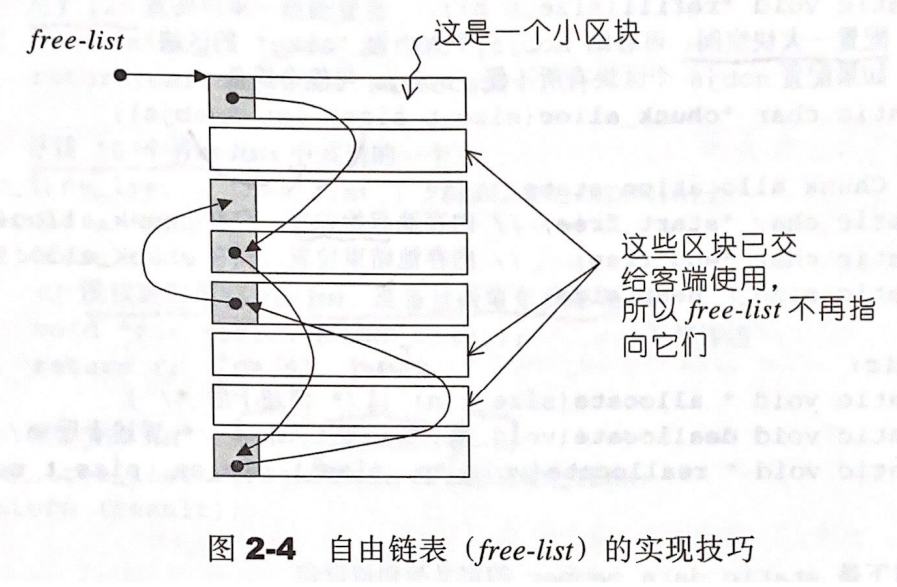

# Chapter 2.2 - SGI 特殊的空间分配器

Created by : Mr Dk.

2021 / 04 / 01 22:10

Nanjing, Jiangsu, China

---

一般而言，在 C++ 中动态分配内存及释放，使用 `new` 和 `delete` 操作符。

其中 `new` 包含两个阶段的操作：

1. 调用 `operator new` 分配内存
2. 调用构造函数构造对象

`delete` 也包含两个阶段的操作：

1. 调用析构函数析构对象
2. 调用 `operator delete` 释放内存

为了减小操作的粒度，寻找机会获得性能上的提升，STL 的空间分配器将这些阶段独立：

- 内存分配由 `alloc::allocate()` 负责
- 内存释放由 `alloc::deallocate()` 负责
- 对象构造由 `::construct()` 负责
- 对象析构由 `::destroy()` 负责

## 2.2.3 构造和析构基本工具：`construct()` 和 `destroy()`

`construct()` 接受的参数包括一个指针和一个初值，作用是将初值设置到该指针所在的位置上。该指针指向的内存 **已经被分配完毕**，可以属于堆空间，也可以属于栈空间。C++ 的 **placement new** 运算符可以完成这样的任务：

```c++
// operator new
Type *t = new Type();

// placement new
Type *p; // p = malloc...
new (p) Type();
```

所以，`construct()` 和 `destroy()` 的工作只关心对象的构造与析构，不关心内存的分配与释放。对于 `construct()` 来说，在已分配完毕的内存上调用 placement new 即可；对于 `destroy()` 来说，手动调用对象的析构函数即可。

```c++
template <class _T1, class _T2>
inline void _Construct(_T1* __p, const _T2& __value) {
  new ((void*) __p) _T1(__value); // 拷贝构造
}

template <class _T1>
inline void _Construct(_T1* __p) {
  new ((void*) __p) _T1(); // 默认构造
}

template <class _Tp>
inline void _Destroy(_Tp* __pointer) {
  __pointer->~_Tp(); // 析构
}
```

其中，`destroy()` 还有接收一对迭代器作为参数的范围版本，用于批量销毁对象。这里引申出是否可以 **高效地** 销毁对象：如果该对象类型的析构函数是 trivial 的 (不涉及对动态分配的内存进行回收)，那么可以什么都不做就结束 (就当这些对象已经被销毁)；如果析构函数是 non-trivial 的，则依次调用每一个对象的析构函数。如何判断数据类型是否具有 trivial 的析构函数呢？通过 STL 的 `__type_traits` 类型特性萃取机制。

批量销毁的最外层函数，将对象数据类型通过 `iterator_traits` 萃取出来：

```c++
template <class _ForwardIterator>
inline void _Destroy(_ForwardIterator __first, _ForwardIterator __last) {
  __destroy(__first, __last, __VALUE_TYPE(__first));
}
```

然后进一步萃取对象的数据类型是否有 trivial 的析构函数：

```c++
template <class _ForwardIterator, class _Tp>
inline void
__destroy(_ForwardIterator __first, _ForwardIterator __last, _Tp*)
{
  typedef typename __type_traits<_Tp>::has_trivial_destructor
          _Trivial_destructor;
  __destroy_aux(__first, __last, _Trivial_destructor());
}
```

最后，实现有 trivial 和无 trivial 情况下的两种销毁函数：

- 无 trivial 的析构函数：依次调用每一个对象的析构函数
- 有 trivial 的析构函数：什么也不做

```c++
template <class _ForwardIterator>
void
__destroy_aux(_ForwardIterator __first, _ForwardIterator __last, __false_type)
{
  for ( ; __first != __last; ++__first)
    destroy(&*__first);
}

template <class _ForwardIterator>
inline void __destroy_aux(_ForwardIterator, _ForwardIterator, __true_type) {}
```

## 2.2.4 空间的分配和释放

SGI 使用 `malloc()` 和 `free()` 完成对内存的分配和释放。设计哲学：

- 内存不足时的应变措施
- 需要分配较多小型内存块时，如何解决内存碎片问题

SGI 设计了 **双层级分配器**：

- 第一级分配器 (`__malloc_alloc_template`) 直接使用 `malloc()` 和 `free()` (128B 以上)
- 第二级分配器 (`__default_alloc_template`) 使用 **内存池** 来管理小块内存

## 2.2.5 第一级分配器 `__malloc_alloc_template` 剖析

第一级分配器直接基于 `malloc()`。

```c++
template <int __inst>
class __malloc_alloc_template {
    // ...
}
```

定义了一下几个函数用于处理 out of memory 的情况：

```c++
static void* _S_oom_malloc(size_t);
static void* _S_oom_realloc(void*, size_t);

static void (* __malloc_alloc_oom_handler)();
```

其中，用户可以注册一个函数指针 `__malloc_alloc_oom_handler`，分配器将在内存分配无法满足需求时调用该函数，开发者可以在这个函数中试图腾出一些位置：

```c++
static void (* __set_malloc_handler(void (*__f)()))()
{
    void (* __old)() = __malloc_alloc_oom_handler;
    __malloc_alloc_oom_handler = __f;
    return(__old);
}
```

当 `malloc()` 无法分配指定内存时，分配器将在一个死循环中不断调用用户注册的函数指针，试着腾出一些内存；如果用户没有注册这个函数指针，那么分配器无技可施，只能抛出 `bad_alloc()` 异常：

```c++
template <int __inst>
void*
__malloc_alloc_template<__inst>::_S_oom_malloc(size_t __n)
{
    void (* __my_malloc_handler)();
    void* __result;

    for (;;) {
        __my_malloc_handler = __malloc_alloc_oom_handler;
        if (0 == __my_malloc_handler) { __THROW_BAD_ALLOC; }
        (*__my_malloc_handler)();
        __result = malloc(__n);
        if (__result) return(__result);
    }
}
```

对于 `realloc()` 的处理也完全类似：

```c++
template <int __inst>
void* __malloc_alloc_template<__inst>::_S_oom_realloc(void* __p, size_t __n)
{
    void (* __my_malloc_handler)();
    void* __result;

    for (;;) {
        __my_malloc_handler = __malloc_alloc_oom_handler;
        if (0 == __my_malloc_handler) { __THROW_BAD_ALLOC; }
        (*__my_malloc_handler)();
        __result = realloc(__p, __n);
        if (__result) return(__result);
    }
}
```

第一级分配器对 `allocate()` / `deallocate()` / `reallocate()` 三个函数的实现就很直截了当：直接调用 `malloc()` / `free()` / `realloc()`，并在内存分配失败时调用上述的处理方法：

```c++
static void* allocate(size_t __n)
{
    void* __result = malloc(__n);
    if (0 == __result) __result = _S_oom_malloc(__n);
    return __result;
}

static void deallocate(void* __p, size_t /* __n */)
{
    free(__p);
}

static void* reallocate(void* __p, size_t /* old_sz */, size_t __new_sz)
{
    void* __result = realloc(__p, __new_sz);
    if (0 == __result) __result = _S_oom_realloc(__p, __new_sz);
    return __result;
}
```

## 2.2.6 第二级分配器 `__default_alloc_template` 剖析

第二级分配器负责避免太多小块内存造成的碎片，同时，还要是管理内存的额外开销尽可能小。如果要分配的内存高于 128B，那么直接交给第一级分配器处理；当要分配的内存小于 128B 时，则使用 **memory pool** 管理：每次分配一大块内存，并将这块内存切分为小块，用一个空闲链表 (free list) 串起来。下次接收到小块内存的分配需求，则直接从 free list 中取出。

SGI 第二级分配器会将任何小额内存需求对齐 8 字节 (上调至 8 字节的倍数)，从而维护了 16 个 free-lists (8 / 16 / 24 / 32 / 40 / 48 / 56 / 64 / 72 / 80 / 88 / 96 / 104 / 112 / 120 / 128)。这 16 个链表指针的初始值都为 0：

```c++
enum {_ALIGN = 8};
enum {_MAX_BYTES = 128};
enum {_NFREELISTS = 16}; // _MAX_BYTES/_ALIGN

static _Obj* __STL_VOLATILE _S_free_list[_NFREELISTS];
```

为了维护链表，需要额外的指针开销吗？答案是不需要：当小块内存不被使用时，其内存块中的前几个 (8 个？) 字节被用于链表指针；当小块内存被使用时，其整块内存都归用户使用。小块内存结点定义如下：

```c++
union _Obj {
    union _Obj* _M_free_list_link;
    char _M_client_data[1];    /* The client sees this.        */
};
```

已被分配的内存块与未被分配的内存块在 free-list 链表中的示意如图：



给定一个内存需求，分配器首先需要根据内存大小将其上扩到对齐 8 字节，然后在 16 个 free-list 中选择合适的链表：

```c++
static size_t
_S_round_up(size_t __bytes)
  { return (((__bytes) + (size_t) _ALIGN-1) & ~((size_t) _ALIGN - 1)); }

static  size_t _S_freelist_index(size_t __bytes) {
    return (((__bytes) + (size_t)_ALIGN-1)/(size_t)_ALIGN - 1);
}
```

## 2.2.7 空间分配函数 `allocate()`

首先判断内存分配大小是否超过 128B，如果超过就使用第一级分配器。如果是小块内存需求，那么将区块上调到对齐 8 字节后，查找对应的 free-list。如果有可用的内存块，则从链表头摘下第一个空闲内存块来并返回；如果没有可用内存块了，那么调用 `refill()` 为链表重新填充空间。

```c++
/* __n must be > 0      */
static void* allocate(size_t __n)
{
    void* __ret = 0;

    if (__n > (size_t) _MAX_BYTES) {         // > 128 bytes
        __ret = malloc_alloc::allocate(__n); // 第一级分配器
    }
    else {
        _Obj* __STL_VOLATILE* __my_free_list
            = _S_free_list + _S_freelist_index(__n); // 找到合适的 free-list
        // Acquire the lock here with a constructor call.
        // This ensures that it is released in exit or during stack
        // unwinding.
        #     ifndef _NOTHREADS
        /*REFERENCED*/
        _Lock __lock_instance;
        #     endif
        _Obj* __RESTRICT __result = *__my_free_list;
        if (__result == 0)
            __ret = _S_refill(_S_round_up(__n)); // refill
        else { // 从 free-list 头部摘下第一个空闲内存块
            *__my_free_list = __result -> _M_free_list_link;
            __ret = __result;
        }
    }

    return __ret;
};
```

## 2.2.8 空间释放函数 `deallocate()`

首先判断待回收内存块的大小。如果大于 128B，就调用第一级分配器回收；否则找到合适的 free-list 并将内存块插回链表的头部。

```c++
/* __p may not be 0 */
static void deallocate(void* __p, size_t __n)
{
    if (__n > (size_t) _MAX_BYTES)
        malloc_alloc::deallocate(__p, __n); // 第一级分配器
    else {
        _Obj* __STL_VOLATILE*  __my_free_list
            = _S_free_list + _S_freelist_index(__n); // 找到合适的 free-list
        _Obj* __q = (_Obj*)__p;

        // acquire lock
        #       ifndef _NOTHREADS
        /*REFERENCED*/
        _Lock __lock_instance;
        #       endif /* _NOTHREADS */
        __q -> _M_free_list_link = *__my_free_list; // 将内存块插入链表
        *__my_free_list = __q;
        // lock is released here
    }
}
```

## 2.2.9 重新填充 Free Lists

当调用 `allocate()` 而相应 free-list 中没有可用内存块时，则调用 `refill()` 来为 free-list 填充空间。新的空间将取自内存池，默认取得 20 个所需内存块大小的空间，但在内存不足时可能并不能取得这么多的内存块：

- 如果只取得了一个内存块，那么直接将这个内存块返回给调用者使用，free-list 没有新内存块
- 如果取得了一个以上的内存块，则将除返回给调用者那一块以外的剩余内存块重新组织为链表

```c++
/* Returns an object of size __n, and optionally adds to size __n free list.*/
/* We assume that __n is properly aligned.                                */
/* We hold the allocation lock.                                         */
template <bool __threads, int __inst>
void*
__default_alloc_template<__threads, __inst>::_S_refill(size_t __n)
{
    int __nobjs = 20; // 默认分配 20 个内存块 (n * nobjs bytes)
    char* __chunk = _S_chunk_alloc(__n, __nobjs); // 从内存池分配
    _Obj* __STL_VOLATILE* __my_free_list;
    _Obj* __result;
    _Obj* __current_obj;
    _Obj* __next_obj;
    int __i;

    if (1 == __nobjs) return(__chunk); // 只获得一个内存块，直接返回给调用者
    __my_free_list = _S_free_list + _S_freelist_index(__n); //

    /* Build free list in chunk */
      __result = (_Obj*)__chunk;
      *__my_free_list = __next_obj = (_Obj*)(__chunk + __n); // 空闲链表指向从内存池分配的起始位置
      for (__i = 1; ; __i++) { // 将空闲内存分块并组织为链表
        __current_obj = __next_obj;
        __next_obj = (_Obj*)((char*)__next_obj + __n);
        if (__nobjs - 1 == __i) {
            __current_obj -> _M_free_list_link = 0;
            break;
        } else {
            __current_obj -> _M_free_list_link = __next_obj;
        }
      }
    return(__result);
}
```

## 2.2.10 内存池 Memory Pool

内存池是程序从堆中获取来的大块内存，在第二级分配器的类中由两个指针来指示空闲内存的起止位置：

```c++
// Chunk allocation state.
static char* _S_start_free;
static char* _S_end_free;
static size_t _S_heap_size; // 已从堆上分配的总内存
```

通过计算 `end_free - start_free` 表达式，可以判断内存池中的剩余空闲内存。

- 如果足够分配 20 个小块内存，则直接把空闲内存拨付出去
- 如果不足以分配 20 个小块内存，但至少能够分配 1 块以上，就拨付这些内存出去
- 如果内存池连 1 块空闲内存也提供不了，就需要调用 `malloc()` 从堆上分配内存，分配量为需求量的 2 倍
  - 1 块内存交出
  - n - 1 块内存进入 free-list
  - n 块内存留在内存池中

如果整个系统堆都不够用了，`malloc()` 无法分配内存，那么 `chunk_alloc()` 将会寻找还有未用内存块且内存块足够大的 free-list：

- 如果找到，就使用这个内存块
- 如果没找到，则调用第一级分配器

第一级分配器实际上也使用了 `malloc()`，但有着用户注册的 out-of-memory 处理指针，使得有机会调用用户注册的代码释放出一部分内存以供使用。如果还是不成功，则最终产生 `bad_alloc` 异常。

```c++
/* We allocate memory in large chunks in order to avoid fragmenting     */
/* the malloc heap too much.                                            */
/* We assume that size is properly aligned.                             */
/* We hold the allocation lock.                                         */
template <bool __threads, int __inst>
char*
__default_alloc_template<__threads, __inst>::_S_chunk_alloc(size_t __size,
                                                            int& __nobjs)
{
    char* __result;
    size_t __total_bytes = __size * __nobjs;
    size_t __bytes_left = _S_end_free - _S_start_free;

    if (__bytes_left >= __total_bytes) { // 内存池剩余空间足够
        __result = _S_start_free;
        _S_start_free += __total_bytes;
        return(__result);
    } else if (__bytes_left >= __size) { // 内存池剩余空间还够 1 个内存块以上
        __nobjs = (int)(__bytes_left/__size);
        __total_bytes = __size * __nobjs;
        __result = _S_start_free;
        _S_start_free += __total_bytes;
        return(__result);
    } else {
        size_t __bytes_to_get =
	  2 * __total_bytes + _S_round_up(_S_heap_size >> 4);
        // Try to make use of the left-over piece.
        if (__bytes_left > 0) {
            _Obj* __STL_VOLATILE* __my_free_list =
                        _S_free_list + _S_freelist_index(__bytes_left);

            ((_Obj*)_S_start_free) -> _M_free_list_link = *__my_free_list;
            *__my_free_list = (_Obj*)_S_start_free;
        }
        _S_start_free = (char*)malloc(__bytes_to_get); // 分配更多的内存
        if (0 == _S_start_free) {
            size_t __i;
            _Obj* __STL_VOLATILE* __my_free_list;
	    _Obj* __p;
            // Try to make do with what we have.  That can't
            // hurt.  We do not try smaller requests, since that tends
            // to result in disaster on multi-process machines.
            for (__i = __size;
                 __i <= (size_t) _MAX_BYTES;
                 __i += (size_t) _ALIGN) {
                __my_free_list = _S_free_list + _S_freelist_index(__i);
                __p = *__my_free_list;
                if (0 != __p) { // 从更大的内存块 free-list 中寻找
                    *__my_free_list = __p -> _M_free_list_link;
                    _S_start_free = (char*)__p;
                    _S_end_free = _S_start_free + __i;
                    return(_S_chunk_alloc(__size, __nobjs));
                    // Any leftover piece will eventually make it to the
                    // right free list.
                }
            }
	    _S_end_free = 0;	// In case of exception.
            _S_start_free = (char*)malloc_alloc::allocate(__bytes_to_get);
            // 使用第一级分配器
            // This should either throw an
            // exception or remedy the situation.  Thus we assume it
            // succeeded.
        }
        // 内存获取成功，更新内存池指针
        _S_heap_size += __bytes_to_get;
        _S_end_free = _S_start_free + __bytes_to_get;
        return(_S_chunk_alloc(__size, __nobjs));
    }
}
```
