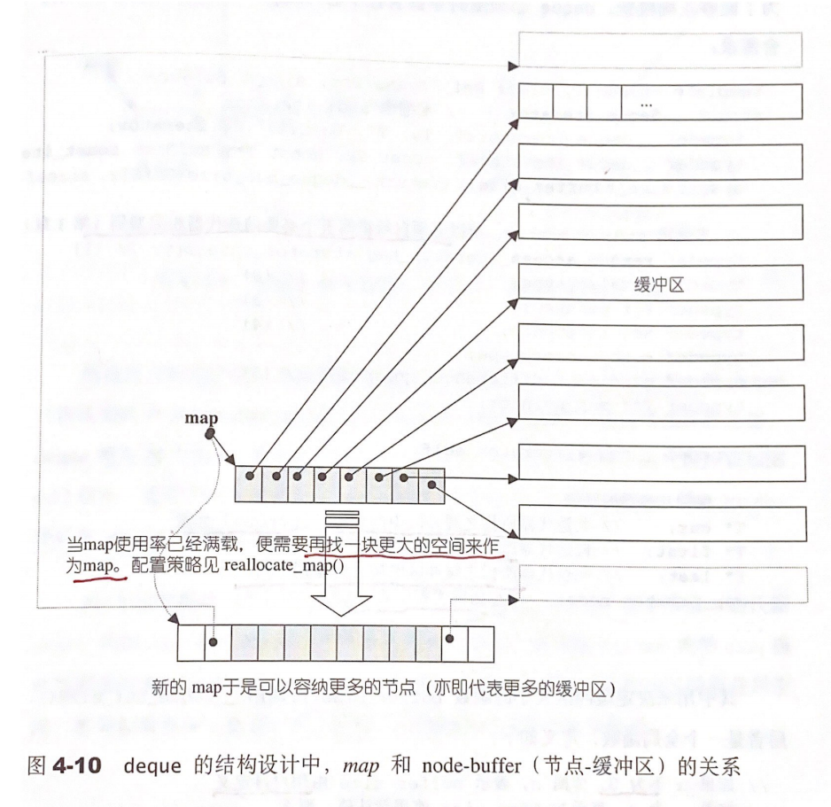
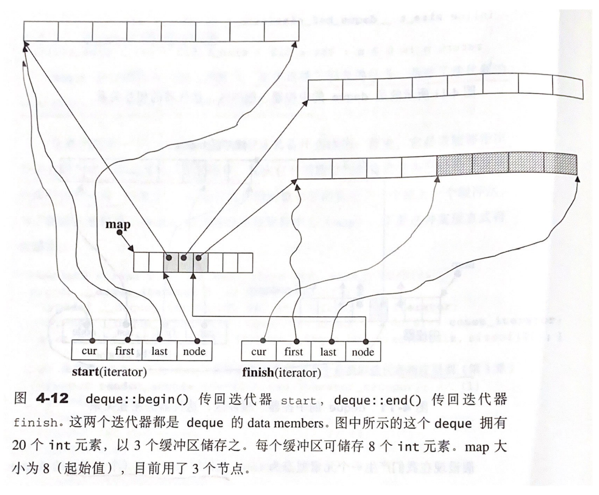

# Chapter 4.4 - deque

Created by : Mr Dk.

2021 / 04 / 04 14:33 🍀

Nanjing, Jiangsu, China

---

## 4.4.1 deque 概述

deque 是一种 **双向开口的连续线性空间**。vector 当然也可以在头尾两端进行操作，但是头部操作的效率奇差。而 deque 允许 **在常数时间内对头尾元素进行插入或移除**。另外，deque 也没有容量的概念，而是以 **动态的分段连续空间** 的形式组合而成：随时可以增加一段新的空间并链接起来。因此，deque 也没有 vector 的 `reserve()` 功能。

deque 也能够提供 Random Access Iterator，但是迭代器肯定不是简单的指针了。迭代器的内部实现屏蔽了 deque 构造的复杂性，但是在性能上显然会逊于 vector 的迭代器。因此，除非必要，应当尽可能优先使用 vector。

## 4.4.2 deque 的中控器

deque 由一段一段的连续空间组成。这些一段一段的连续空间本身需要由数据结构来维护。这个数据结构就是中控器 map。当 deque 的前端或后端的空间不够用时，则分配一段新的连续空间，并将空间维护在 map 中。map 本身也是一小块连续空间，可被视为是一个 **指针数组**，里面的每个指针指向一段缓冲区 - 缓冲区才是 deque 的存储主体。SGI STL 允许用户指定缓冲区大小，或使用默认的 512 bytes。

```cpp
template <class _Tp, class _Alloc>
class _Deque_base {
  // ...
protected:
  _Tp** _M_map;
  // ...
};
```



当 map 本身不够用时，map 自己需要被扩容，以便容纳更多指向缓冲区的指针。

## 4.4.3 deque 的迭代器

由于 deque 时分段连续空间，而迭代器需要实现随机存取。因此，deque 的迭代器需要尽全力 **维持整体连续的假象**。由迭代器的 `operator++` 和 `operator--` 两个运算符来实现这一功能。

deque 的迭代器不仅需要知道自己当当前缓冲区中是否已经到达边缘，同时还需要知道自己在哪个缓冲区中。当迭代器前进或后退时，可能需要切换缓冲区。因此迭代器的定义中有几个重要的指针：

```cpp
template <class _Tp, class _Ref, class _Ptr>
struct _Deque_iterator {
  typedef _Deque_iterator<_Tp, _Tp&, _Tp*>             iterator;
  typedef _Deque_iterator<_Tp, const _Tp&, const _Tp*> const_iterator;
  static size_t _S_buffer_size() { return __deque_buf_size(sizeof(_Tp)); }

  typedef random_access_iterator_tag iterator_category;
  typedef _Tp value_type;
  typedef _Ptr pointer;
  typedef _Ref reference;
  typedef size_t size_type;
  typedef ptrdiff_t difference_type;
  typedef _Tp** _Map_pointer;

  typedef _Deque_iterator _Self;

  _Tp* _M_cur;          // 当前缓冲区中的当前位置
  _Tp* _M_first;        // 当前缓冲区中的头
  _Tp* _M_last;         // 当前缓冲区中的尾 (包括未使用的空间在内)
  _Map_pointer _M_node; // 指向 map

  // ...
};
```

deque 类内也维护着两个重要的迭代器 `start` 和 `finish`：

- `start` 迭代器的 `cur` 指针指向 deque 内第一个缓冲区的第一个 (已被使用) 的位置
- `finish` 迭代器的 `cur` 指针指向 deque 内最后一个缓冲区的最后一个 (已被使用) 的位置的下一个位置

这两个迭代器的 `cur` 指针标定了 deque 的数据访问范围。如图所示：



deque 迭代器的关键行为在于对所有运算符的正确重载。尤其是当迭代器遇到缓冲区边缘时，需要调用 `set_node()` 跳到另一个缓冲区中。该函数负责重新设置 `cur`、`first`、`last` 指针：

```cpp
  void _M_set_node(_Map_pointer __new_node) {
    _M_node = __new_node;
    _M_first = *__new_node;
    _M_last = _M_first + difference_type(_S_buffer_size());
  }
```

解引用运算符直接使用 `cur` 指针：

```cpp
reference operator*() const { return *_M_cur; }
pointer operator->() const { return _M_cur; }
```

`operator-` 运算符计算两个迭代器之间的距离。这个距离包含三个部分：

- 两个迭代器之间的完整缓冲区个数 \* 缓冲区大小
- 当前迭代器所在缓冲区中，`cur` 与 `first` 之间的距离
- 参数迭代器所在缓冲区中，`cur` 与 `last` 之间的距离

```cpp
difference_type operator-(const _Self& __x) const {
    return difference_type(_S_buffer_size()) * (_M_node - __x._M_node - 1) +
        (_M_cur - _M_first) + (__x._M_last - __x._M_cur);
}
```

`operator++` 和 `operator--` 运算符在修改 `cur` 的同时，需要判断是否到达缓冲区边界：

- 如果到达缓冲区前边界，那么跳到前一个缓冲区，并将 `cur` 设置为缓冲区最后一个元素的下一个位置
- 如果到达缓冲区后边界，那么跳到后一个缓冲区，并将 `cur` 设置为缓冲区的第一个元素

```cpp
_Self& operator++() {
    ++_M_cur;
    if (_M_cur == _M_last) {
        _M_set_node(_M_node + 1);
        _M_cur = _M_first;
    }
    return *this;
}
_Self operator++(int)  {
    _Self __tmp = *this;
    ++*this;
    return __tmp;
}

_Self& operator--() {
    if (_M_cur == _M_first) {
        _M_set_node(_M_node - 1);
        _M_cur = _M_last;
    }
    --_M_cur;
    return *this;
}
_Self operator--(int) {
    _Self __tmp = *this;
    --*this;
    return __tmp;
  }
```

`operator+=` 和 `operator-=` (附带 `operator+` 和 `operator-`) 实现了返回一个随机访问迭代器。对于给定的参数，需要通过计算确定其跨越了几个缓冲区，然后计算确定在目标缓冲区中 `cur` 的最终位置：

```cpp
_Self& operator+=(difference_type __n)
{
    difference_type __offset = __n + (_M_cur - _M_first);
    if (__offset >= 0 && __offset < difference_type(_S_buffer_size()))
        _M_cur += __n; // 不超出当前缓冲区
    else {
        difference_type __node_offset =
            __offset > 0 ? __offset / difference_type(_S_buffer_size())
            : -difference_type((-__offset - 1) / _S_buffer_size()) - 1;
        _M_set_node(_M_node + __node_offset); // 切换缓冲区
        _M_cur = _M_first +  // 确定 cur 指针的最终位置
            (__offset - __node_offset * difference_type(_S_buffer_size()));
    }
    return *this;
}

_Self operator+(difference_type __n) const
{
    _Self __tmp = *this;
    return __tmp += __n; // 借用 += 的实现
}

_Self& operator-=(difference_type __n) { return *this += -__n; } // 借用 += 的实现

_Self operator-(difference_type __n) const {
    _Self __tmp = *this;
    return __tmp -= __n; // 借用 -= 的实现
}
```

`operator[]` 可以实现元素的随机访问，内部实际上借用了 `operator+` 的实现：

```cpp
reference operator[](difference_type __n) const { return *(*this + __n); }
```

所有的迭代器比较操作都取决于：

1. 所属缓冲区
2. 所属缓冲区相同的前提下，`cur` 指针的位置

```cpp
bool operator==(const _Self& __x) const { return _M_cur == __x._M_cur; }
bool operator!=(const _Self& __x) const { return !(*this == __x); }
bool operator<(const _Self& __x) const {
    return (_M_node == __x._M_node) ?
        (_M_cur < __x._M_cur) : (_M_node < __x._M_node);
}
bool operator>(const _Self& __x) const  { return __x < *this; }
bool operator<=(const _Self& __x) const { return !(__x < *this); }
bool operator>=(const _Self& __x) const { return !(*this < __x); }
```

## 4.4.4 deque 的数据结构

deque 最重要的成员变量是一个指向 map 的指针，以及刚才提到的 `start` 和 `finish` 两个迭代器。另外，将默认的 `alloc` 分配器封装为两个分配器，一个以缓冲区大小为单位分配内存 (用于分配新的缓冲区)，一个以缓冲区指针的大小为单位分配内存 (用于分配新的 map 以扩容)：

```cpp
template <class _Tp, class _Alloc>
class _Deque_base {
public:
  typedef _Deque_iterator<_Tp,_Tp&,_Tp*>             iterator;
  typedef _Deque_iterator<_Tp,const _Tp&,const _Tp*> const_iterator;

  typedef _Alloc allocator_type;
  allocator_type get_allocator() const { return allocator_type(); }

  _Deque_base(const allocator_type&, size_t __num_elements)
    : _M_map(0), _M_map_size(0),  _M_start(), _M_finish() {
    _M_initialize_map(__num_elements);
  }
  _Deque_base(const allocator_type&)
    : _M_map(0), _M_map_size(0),  _M_start(), _M_finish() {}
  ~_Deque_base();

protected:
  void _M_initialize_map(size_t);
  void _M_create_nodes(_Tp** __nstart, _Tp** __nfinish);
  void _M_destroy_nodes(_Tp** __nstart, _Tp** __nfinish);
  enum { _S_initial_map_size = 8 };

protected:
  _Tp** _M_map;       // 指向 map
  size_t _M_map_size; // map 的大小
  iterator _M_start;  // start 迭代器
  iterator _M_finish; // finish 迭代器

  typedef simple_alloc<_Tp, _Alloc>  _Node_alloc_type;
  typedef simple_alloc<_Tp*, _Alloc> _Map_alloc_type;

  _Tp* _M_allocate_node()
    { return _Node_alloc_type::allocate(__deque_buf_size(sizeof(_Tp))); }
  void _M_deallocate_node(_Tp* __p)
    { _Node_alloc_type::deallocate(__p, __deque_buf_size(sizeof(_Tp))); }
  _Tp** _M_allocate_map(size_t __n)
    { return _Map_alloc_type::allocate(__n); }
  void _M_deallocate_map(_Tp** __p, size_t __n)
    { _Map_alloc_type::deallocate(__p, __n); }
};
```

有了 `start` 和 `finish` 迭代器，以及迭代器重载的所有运算符，可以轻松实现以下成员函数：

```cpp
iterator begin() { return _M_start; }
iterator end() { return _M_finish; }
const_iterator begin() const { return _M_start; }
const_iterator end() const { return _M_finish; }

reference operator[](size_type __n)
    { return _M_start[difference_type(__n)]; } // 从第一个有效元素开始随机访问
const_reference operator[](size_type __n) const
    { return _M_start[difference_type(__n)]; }

reference front() { return *_M_start; }
reference back() {
    iterator __tmp = _M_finish;
    --__tmp;
    return *__tmp;
}
const_reference front() const { return *_M_start; }
const_reference back() const {
    const_iterator __tmp = _M_finish;
    --__tmp;
    return *__tmp;
}

size_type size() const { return _M_finish - _M_start; }
size_type max_size() const { return size_type(-1); }
bool empty() const { return _M_finish == _M_start; }
```

## 4.4.5 deque 的构造与内存管理

deque 本身最复杂的地方在于插入和删除时造成的缓冲区分配与回收；另外，当 map 本身不够用时，又牵扯到 map 的重新分配与释放。

deque 的构造函数支持用户设定缓冲区中的元素个数，但是显式声明意味着要把之前的缺省参数补齐。另外，还支持保留指定个数的元素空间。

> ？咋没有第三个模板参数

```cpp
template <class _Tp, class _Alloc = __STL_DEFAULT_ALLOCATOR(_Tp) >
class deque : protected _Deque_base<_Tp, _Alloc> {
    // ...
};
```

在构造函数中，根据要保留的元素个数，决定如何对 map 进行初始化：

```cpp
_Deque_base(const allocator_type&, size_t __num_elements)
    : _M_map(0), _M_map_size(0),  _M_start(), _M_finish() {
        _M_initialize_map(__num_elements);
    }
```

调用 `initialize_map()` 来构造 map：

```cpp
template <class _Tp, class _Alloc>
void
_Deque_base<_Tp,_Alloc>::_M_initialize_map(size_t __num_elements)
{
  size_t __num_nodes =
    __num_elements / __deque_buf_size(sizeof(_Tp)) + 1; // 容纳指定元素需要的缓冲区个数

  _M_map_size = max((size_t) _S_initial_map_size, __num_nodes + 2); // map 内前后各预留一个空指针备用
  // enum { _S_initial_map_size = 8 };
  // 最少要有 8 个缓冲区指针的空间

  _M_map = _M_allocate_map(_M_map_size); // 分配 map 内存

  // 从 map 的中间开始启用 (前后留空)
  _Tp** __nstart = _M_map + (_M_map_size - __num_nodes) / 2;
  _Tp** __nfinish = __nstart + __num_nodes;

  __STL_TRY {
    _M_create_nodes(__nstart, __nfinish); // 依次创建每一个缓冲区
  }
  __STL_UNWIND((_M_deallocate_map(_M_map, _M_map_size), // 失败时回滚所有已创建缓冲区
                _M_map = 0, _M_map_size = 0));
  // 设置 start 和 finish 迭代器所在的结点和 cur 指针
  _M_start._M_set_node(__nstart);
  _M_finish._M_set_node(__nfinish - 1);
  _M_start._M_cur = _M_start._M_first;
  _M_finish._M_cur = _M_finish._M_first +
               __num_elements % __deque_buf_size(sizeof(_Tp));
}
```

```cpp
template <class _Tp, class _Alloc>
void _Deque_base<_Tp,_Alloc>::_M_create_nodes(_Tp** __nstart, _Tp** __nfinish)
{
  _Tp** __cur;
  __STL_TRY {
    for (__cur = __nstart; __cur < __nfinish; ++__cur)
      *__cur = _M_allocate_node();
  }
  __STL_UNWIND(_M_destroy_nodes(__nstart, __cur));
}
```

以 `push_back()` 为例。如果 `finish` 迭代器指向的缓冲区 (最后一个缓冲区) 中还有两个以上的备用空间，那么直接在备用空间上构造元素即可；如果只剩一个备用空间了，那么在构造元素后，还需要分配新的缓冲区，并把 `finish` 迭代器切换到新的缓冲区上。`push_front()` 的思路也类似，只不过是换了个方向。

```cpp
void push_back(const value_type& __t) {
    if (_M_finish._M_cur != _M_finish._M_last - 1) {
        construct(_M_finish._M_cur, __t);
        ++_M_finish._M_cur;
    }
    else
        _M_push_back_aux(__t);
}

void push_front(const value_type& __t) {
    if (_M_start._M_cur != _M_start._M_first) {
        construct(_M_start._M_cur - 1, __t);
        --_M_start._M_cur;
    }
    else
        _M_push_front_aux(__t);
}

// Called only if _M_finish._M_cur == _M_finish._M_last - 1.
template <class _Tp, class _Alloc>
void deque<_Tp,_Alloc>::_M_push_back_aux(const value_type& __t)
{
  value_type __t_copy = __t;
  _M_reserve_map_at_back(); // 确保 map 的后端有空闲的指针用于分配缓冲区
  *(_M_finish._M_node + 1) = _M_allocate_node(); // 分配缓冲区
  __STL_TRY {
    construct(_M_finish._M_cur, __t_copy); // 在 finish 迭代器的 cur 指针所在位置构造元素
    _M_finish._M_set_node(_M_finish._M_node + 1); // 切换 finish 迭代器到新分配的缓冲区
    _M_finish._M_cur = _M_finish._M_first; // finish 迭代器的 cur 指针指向新缓冲区的第一个位置
  }
  __STL_UNWIND(_M_deallocate_node(*(_M_finish._M_node + 1))); // 回滚
}

// Called only if _M_start._M_cur == _M_start._M_first.
template <class _Tp, class _Alloc>
void  deque<_Tp,_Alloc>::_M_push_front_aux(const value_type& __t)
{
  value_type __t_copy = __t;
  _M_reserve_map_at_front();
  *(_M_start._M_node - 1) = _M_allocate_node();
  __STL_TRY {
    _M_start._M_set_node(_M_start._M_node - 1);
    _M_start._M_cur = _M_start._M_last - 1;
    construct(_M_start._M_cur, __t_copy);
  }
  __STL_UNWIND((++_M_start, _M_deallocate_node(*(_M_start._M_node - 1))));
}
```

这里引出了问题：如果 map 中的空间不够用了怎么办？不妨看看 `reserve_map_at_back()` 和 `reserve_map_at_front()` 是怎么干的。这两个函数不负责分配缓冲区，只负责重新分配一个更大的 map，并将原来 map 中的缓冲区指针搬运到新的 map 中，并析构释放原来的 map。

```cpp
// Makes sure the _M_map has space for new nodes.  Does not actually
//  add the nodes.  Can invalidate _M_map pointers.  (And consequently,
//  deque iterators.)

void _M_reserve_map_at_back (size_type __nodes_to_add = 1) {
    if (__nodes_to_add + 1 > _M_map_size - (_M_finish._M_node - _M_map))
        _M_reallocate_map(__nodes_to_add, false);
}

void _M_reserve_map_at_front (size_type __nodes_to_add = 1) {
    if (__nodes_to_add > size_type(_M_start._M_node - _M_map))
        _M_reallocate_map(__nodes_to_add, true);
}
```

其中，完成核心功能的是 `reallocate_map()` 函数，通过参数来决定向前扩容还是向后扩容：

```cpp
template <class _Tp, class _Alloc>
void deque<_Tp,_Alloc>::_M_reallocate_map(size_type __nodes_to_add,
                                          bool __add_at_front)
{
  size_type __old_num_nodes = _M_finish._M_node - _M_start._M_node + 1; // map 内原有指针数
  size_type __new_num_nodes = __old_num_nodes + __nodes_to_add; // 原有指针数 + 1 (缺省值)

  _Map_pointer __new_nstart;
  if (_M_map_size > 2 * __new_num_nodes) { // 不需重新分配，前后不均罢了，将有效指针搬运到 map 中间
    __new_nstart = _M_map + (_M_map_size - __new_num_nodes) / 2
                     + (__add_at_front ? __nodes_to_add : 0);
    if (__new_nstart < _M_start._M_node)
      copy(_M_start._M_node, _M_finish._M_node + 1, __new_nstart);
    else
      copy_backward(_M_start._M_node, _M_finish._M_node + 1,
                    __new_nstart + __old_num_nodes);
  }
  else { // 需要重新分配 map
    size_type __new_map_size =
      _M_map_size + max(_M_map_size, __nodes_to_add) + 2; // 新的 map 大小

    _Map_pointer __new_map = _M_allocate_map(__new_map_size); // 分配
    __new_nstart = __new_map + (__new_map_size - __new_num_nodes) / 2
                         + (__add_at_front ? __nodes_to_add : 0);
    copy(_M_start._M_node, _M_finish._M_node + 1, __new_nstart); // 将原有效指针搬运到 map 中间
    _M_deallocate_map(_M_map, _M_map_size); // 释放原来的 map

    _M_map = __new_map; // 更改 map 指针与大小
    _M_map_size = __new_map_size;
  }

  // 重新设置 start 和 finish 迭代器
  _M_start._M_set_node(__new_nstart);
  _M_finish._M_set_node(__new_nstart + __old_num_nodes - 1);
}
```

## 4.4.6 deque 的元素操作

`pop` 操作需要判断被删除的元素是否是当前缓冲区中的最后一个元素：

- 如果不是，则直接析构元素，并调整 `cur` 指针
- 如果是，那么切换缓冲区，重新调整 `cur` 指针，销毁元素，此外还需要释放缓冲区

```cpp
void pop_back() {
    if (_M_finish._M_cur != _M_finish._M_first) {
        --_M_finish._M_cur;
        destroy(_M_finish._M_cur); // 直接析构
    }
    else
        _M_pop_back_aux(); // 需要释放缓冲区
}

void pop_front() {
    if (_M_start._M_cur != _M_start._M_last - 1) {
        destroy(_M_start._M_cur); // 直接析构
        ++_M_start._M_cur;
    }
    else
        _M_pop_front_aux(); // 需要释放缓冲区
}

// Called only if _M_finish._M_cur == _M_finish._M_first.
template <class _Tp, class _Alloc>
void deque<_Tp,_Alloc>::_M_pop_back_aux()
{
  _M_deallocate_node(_M_finish._M_first); // 释放缓冲区
  _M_finish._M_set_node(_M_finish._M_node - 1); // 切换缓冲区
  _M_finish._M_cur = _M_finish._M_last - 1;
  destroy(_M_finish._M_cur); // 析构元素
}

// Called only if _M_start._M_cur == _M_start._M_last - 1.  Note that
// if the deque has at least one element (a precondition for this member
// function), and if _M_start._M_cur == _M_start._M_last, then the deque
// must have at least two nodes.
template <class _Tp, class _Alloc>
void deque<_Tp,_Alloc>::_M_pop_front_aux()
{
  destroy(_M_start._M_cur);
  _M_deallocate_node(_M_start._M_first);
  _M_start._M_set_node(_M_start._M_node + 1);
  _M_start._M_cur = _M_start._M_first;
}
```

`clear()` 清除整个 deque。deque 在最初状态 (无任何元素) 时保有一个缓冲区。

```cpp
template <class _Tp, class _Alloc>
void deque<_Tp,_Alloc>::clear()
{
  for (_Map_pointer __node = _M_start._M_node + 1;
       __node < _M_finish._M_node; // 释放除头尾缓冲区以外的缓冲区
       ++__node) {
    destroy(*__node, *__node + _S_buffer_size());
    _M_deallocate_node(*__node);
  }

  if (_M_start._M_node != _M_finish._M_node) { // 头尾缓冲区不是同一个
    destroy(_M_start._M_cur, _M_start._M_last); // 析构头缓冲区内所有元素
    destroy(_M_finish._M_first, _M_finish._M_cur); // 析构尾缓冲区内所有元素
    _M_deallocate_node(_M_finish._M_first); // 释放尾缓冲区 (保留头缓冲区)
  }
  else // 头尾缓冲区是同一个缓冲区
    destroy(_M_start._M_cur, _M_finish._M_cur); // 析构所有元素 (但不释放缓冲区)

  _M_finish = _M_start;
}
```

`erase()` 清除某一个或某个区间内的元素。清除单个元素时，首先判断清楚位置之前与之后的元素哪边更多，移动较少那一端的元素以减小搬运代价。移动完毕后，调用 `pop_back()` 或 `pop_front()` 移除边界冗余的元素 (这两个函数还会自动释放冗余缓冲区)。

```cpp
iterator erase(iterator __pos) {
    iterator __next = __pos;
    ++__next;
    difference_type __index = __pos - _M_start;
    if (size_type(__index) < (this->size() >> 1)) {
        copy_backward(_M_start, __pos, __next);
        pop_front();
    }
    else {
        copy(__next, _M_finish, __pos);
        pop_back();
    }
    return _M_start + __index;
}
```

如果要移除的是一个区间，同样需要判断区间之前与区间之后的元素哪边更多，移动剩余元素较少的那一端。搬运完毕后，将冗余的元素全部删除，并释放已经冗余的缓冲区。

```cpp
template <class _Tp, class _Alloc>
typename deque<_Tp,_Alloc>::iterator
deque<_Tp,_Alloc>::erase(iterator __first, iterator __last)
{
  if (__first == _M_start && __last == _M_finish) {
    clear();
    return _M_finish;
  }
  else {
    difference_type __n = __last - __first;
    difference_type __elems_before = __first - _M_start;
    if (__elems_before < difference_type((this->size() - __n) / 2)) {
      copy_backward(_M_start, __first, __last);
      iterator __new_start = _M_start + __n;
      destroy(_M_start, __new_start);
      _M_destroy_nodes(__new_start._M_node, _M_start._M_node);
      _M_start = __new_start;
    }
    else {
      copy(__last, _M_finish, __first);
      iterator __new_finish = _M_finish - __n;
      destroy(__new_finish, _M_finish);
      _M_destroy_nodes(__new_finish._M_node + 1, _M_finish._M_node + 1);
      _M_finish = __new_finish;
    }
    return _M_start + __elems_before;
  }
}
```

`insert()` 在某个位置 (之前) 插入元素。首先判断插入位置是否在前后两个端点，如果是，则直接使用 `push_back()` / `push_front()` 完成功能；否则，将最前端 / 最后段插入与第一个元素 / 最后一个元素值相同的元素，并通过搬运元素使得插入位置留空，最终将新值放到插入位置上。

```cpp
template <class _Tp, class _Alloc>
typename deque<_Tp, _Alloc>::iterator
deque<_Tp,_Alloc>::_M_insert_aux(iterator __pos, const value_type& __x)
{
  difference_type __index = __pos - _M_start;
  value_type __x_copy = __x;
  if (size_type(__index) < this->size() / 2) {
    push_front(front()); // 可能导致扩容缓冲区
    iterator __front1 = _M_start;
    ++__front1;
    iterator __front2 = __front1;
    ++__front2;
    __pos = _M_start + __index;
    iterator __pos1 = __pos;
    ++__pos1;
    copy(__front2, __pos1, __front1);
  }
  else {
    push_back(back()); // 可能导致扩容缓冲区
    iterator __back1 = _M_finish;
    --__back1;
    iterator __back2 = __back1;
    --__back2;
    __pos = _M_start + __index;
    copy_backward(__pos, __back2, __back1);
  }
  *__pos = __x_copy; // 在空位上插入元素
  return __pos;
}
```

以上，`erase()` 和 `insert()` 能够成功实现的前提都是 `copy()` 和 `copy_backward()` 的正确操作。而这两个操作应当都是使用了 deque 迭代器屏蔽了底层细节，从而实现了可能的跨缓冲区的顺利复制。
